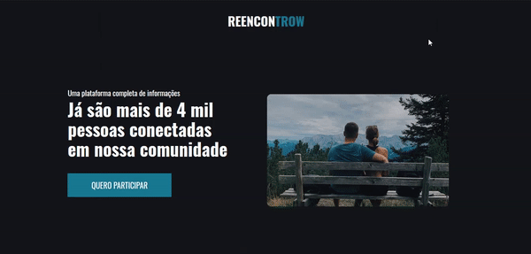

> Status: Concluded ✔️

### It's a landing page designed to demonstrate my knowledge with HTML and CSS.

## Technologies used:
<table>
  <tr>
    <th>Technology</th>
    <th>Version</th>
  </tr>
  <tr>
    <td>HTML</td>
    <td>5</td>
  </tr>
  <tr>
    <td>CSS</td>
    <td>3</td>
  </tr>
</table>

### How to run application
 1. Download the files for your machine;
 2. extract the files;
 3. Double click on the "index.html" file and it will be click on your default browser.

## Landing page demo
<figure>
  
</figure>

 Link to web page <a>https://encontrow-gamma.vercel.app/</a>
